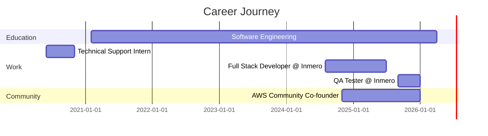

<div align="center">
  
</div>

<h3 align="center">
  
</h3>

---

### 👋 ¡Hola! / Hello!

<table>
<tr>
<td width="50%">

#### 🇪🇸 Español

Soy **Oscar Andrade**, un apasionado Ingeniero de Software en formación de **Bogotá, Colombia**. Actualmente trabajo como **QA Tester** en Inmero y soy cofundador de la **comunidad AWS en Neiva**, la primera del sur de Colombia.

Me especializo en:
- 🚀 Desarrollo Full Stack (React, Django, Spring Boot)
- 🧪 Quality Assurance y Testing
- ☁️ Soluciones Cloud con AWS
- 🤖 IoT y automatización

Creo en el código limpio, las buenas prácticas y el aprendizaje continuo. Siempre buscando nuevos desafíos y oportunidades para crecer profesionalmente.

</td>
<td width="50%">

#### 🇺🇸 English

I'm **Oscar Andrade**, a passionate Software Engineering student from **Bogotá, Colombia**. Currently working as a **QA Tester** at Inmero and co-founder of the **AWS community in Neiva**, the first in southern Colombia.

I specialize in:
- 🚀 Full Stack Development (React, Django, Spring Boot)
- 🧪 Quality Assurance & Testing
- ☁️ AWS Cloud Solutions
- 🤖 IoT & Automation

I believe in clean code, best practices, and continuous learning. Always looking for new challenges and opportunities for professional growth.

</td>
</tr>
</table>

---

### 💼 Current Role

```yaml
position: QA Tester @ Inmero
location: Colombia 🇨🇴
focus: [Functional Testing, Regression Testing, Test Automation, Security Testing]
previous_role: Full Stack Developer @ Inmero (2024-2025)
education: Software Engineering @ Universidad Surcolombiana (10th semester)
```

---

### 🛠️ Tech Stack

<div align="center">

#### Languages


#### Frontend


#### Backend


#### Databases


#### DevOps & Cloud


</div>

---

### 📊 GitHub Stats

<div align="center">
  
  
</div>

<div align="center">
  
</div>

---

### 🚀 Featured Projects

<details>
<summary><b>💰 Payment & Billing Management System (Freelance)</b></summary>
<br>

**Description:** Automated invoice and payment registration system, replacing manual processes with advanced features.

**Features:**
- 🔐 Role-based access control
- 📊 Portfolio management and tracking
- 🔍 Advanced queries and reporting
- 📱 Responsive web interface

**Tech Stack:** `React` `Django` `PostgreSQL` `Docker` `Railway`

</details>

<details>
<summary><b>💧 Dis Riego - Irrigation District Management Platform</b></summary>
<br>

**Description:** Web and mobile platform for managing irrigation districts with IoT integration.

**Features:**
- 🌐 Full stack web and mobile application
- 📡 IoT device integration for remote monitoring
- 📈 Data analysis with AI techniques
- ☁️ Cloud deployment with DevOps practices

**Tech Stack:** `Full Stack Development` `IoT` `Cloud` `DevOps`

</details>

<details>
<summary><b>🧪 Coagronet - Inventory Management System (QA Project)</b></summary>
<br>

**Description:** Quality assurance for inventory management system.

**Responsibilities:**
- ✅ Functional and regression testing
- 🔒 Security testing
- 🤖 Automated testing in Docker environments
- 💾 Database validation and integrity checks

**Tech Stack:** `QA Testing` `Docker` `Database Testing`

</details>

---

### 🌟 Achievements & Community

<table>
<tr>
<td width="50%">

#### ☁️ AWS Community Leader
**Co-founder - AWS Community Neiva** (Nov 2024 - Present)
- 🎯 First AWS community in southern Colombia
- 📚 Organization of technical workshops and events
- 🤝 Building a local tech network
- 💡 Promoting cloud solutions adoption

</td>
<td width="50%">

#### 🔬 Research Member
**Universidad Surcolombiana** (Aug 2024 - Present)
- 🛡️ Web application security development
- 🔐 Data protection and privacy focus
- 🏃 Agile methodologies (Scrum)
- 📱 Practical project delivery

</td>
</tr>
</table>

---

### 📫 Let's Connect!

<div align="center">

[](https://www.linkedin.com/in/oscar-julian-andrade-chila-a1932b337/)
[](https://github.com/Ojachi)
[](mailto:ojachila@gmail.com)

📍 **Location:** Bogotá, Colombia  
📱 **Phone:** +57 318 388 6495  
💼 **Open to:** Full-time opportunities, Freelance projects, Collaborations

</div>

---

### 💡 What I Can Bring to Your Team

```javascript
const oscar = {
  code: ["JavaScript", "Python", "Java", "PHP"],
  technologies: {
    frontEnd: ["React", "HTML", "CSS"],
    backEnd: ["Django", "FastAPI", "Spring Boot"],
    databases: ["PostgreSQL", "MongoDB"],
    devOps: ["Docker", "AWS", "Git"],
    testing: ["Functional Testing", "Regression", "Automation", "Security"]
  },
  architecture: ["MVC", "Microservices", "RESTful APIs"],
  currentFocus: "Building scalable and secure applications",
  funFact: "I helped start the first AWS community in southern Colombia!"
};
```

---

### 📈 Professional Experience Timeline



---

### 🎯 Current Goals for 2026

- ✅ Complete Software Engineering degree
- 🚀 Expand AWS community in Colombia
- 📚 Get AWS certifications
- 💻 Contribute to open-source projects
- 🌐 Build a personal tech blog
- 🤝 Mentor junior developers

---

<div align="center">
  
### 💭 Quote I Live By

*"The best way to predict the future is to invent it." - Alan Kay*

---


</div>
