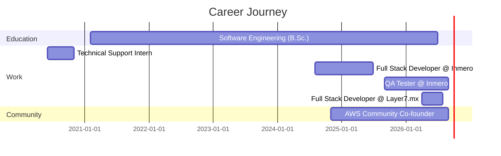

<div align="center">
  
</div>

<h3 align="center">
  
</h3>

---

### 👋 ¡Hola! / Hello!

<table>
<tr>
<td width="50%">

#### 🇪🇸 Español

Soy **Oscar Andrade**, **Ingeniero de Software Full-Stack** de **Bogotá, Colombia**. Actualmente trabajo como **QA Tester** en Inmero y soy cofundador de la **comunidad AWS en Neiva**, la primera del sur de Colombia.

Me especializo en:
- 🚀 Desarrollo Full Stack (C#, ASP.NET Core, React, TypeScript)
- 🧪 Quality Assurance y automatización de pruebas
- ☁️ Soluciones cloud con AWS y despliegues CI/CD
- 🤖 Automatización e IoT

Creo en el código limpio, las buenas prácticas y el aprendizaje continuo. Siempre buscando nuevos desafíos y oportunidades para crecer profesionalmente.

</td>
<td width="50%">

#### 🇺🇸 English

I'm **Oscar Andrade**, a **Full-Stack Software Engineer** from **Bogotá, Colombia**. Currently working as a **QA Tester** at Inmero and co-founder of the **AWS community in Neiva**, the first in southern Colombia.

I specialize in:
- 🚀 Full Stack Development (C#, ASP.NET Core, React, TypeScript)
- 🧪 Quality Assurance & Test Automation
- ☁️ AWS Cloud Solutions & CI/CD pipelines
- 🤖 Automation & IoT

I believe in clean code, best practices, and continuous learning. Always looking for new challenges and opportunities for professional growth.

</td>
</tr>
</table>

---

### 💼 Current Role

```yaml
position: QA Tester @ Inmero
location: Bogotá, Colombia 🇨🇴
focus: [Functional Testing, Regression Testing, Test Automation, API Testing]
previous_roles:
  - Full Stack Developer @ Layer7.mx (remote, part-time) — 2026
  - Full Stack Developer @ Inmero (2024-2025)
education: Software Engineer — Universidad Surcolombiana (Graduated Jul 2026) 🎓
certifications:
  - AWS Certified AI Practitioner — exam Sep 30, 2026
  - Full Stack Empresarial (Spring Boot & Angular) — Dev Senior Code
  - Claude Code in Action
```

---

### 🛠️ Tech Stack

<div align="center">

#### Languages


#### Frontend


#### Backend & APIs


#### Databases


#### Auth & Security


#### DevOps & Cloud


#### Testing & QA


#### AI & Tooling


</div>

---

### 🎓 Certifications

| Certification | Issuer | Status |
| --- | --- | --- |
| **AWS Certified AI Practitioner** | Amazon Web Services | 📅 Exam: Sep 30, 2026 |
| **Full Stack Empresarial** (Spring Boot & Angular) | Dev Senior Code | ✅ Completed |
| **Claude Code in Action** | Anthropic | ✅ Completed |

---

### 🗣️ Languages

| Language | Level | Training |
| --- | --- | --- |
| 🇪🇸 Español | Nativo | — |
| 🇺🇸 English | B2 (Upper-Intermediate) | KOE (2018–2019) · Lingui Academy (2023–2025) |

---

### 📊 GitHub Stats

<div align="center">
  
  
</div>

<div align="center">
  
</div>

---

### 🚀 Featured Projects

<details>
<summary><b>📦 Inventory Management System (Inmero)</b></summary>
<br>

**Description:** Full-stack inventory management platform, from REST API design to automated deployment.

**Features:**
- 🔗 REST APIs built with ASP.NET Core, documented with Swagger/OpenAPI
- 🔐 JWT authentication and authorization, including login and token refresh flows
- ⚛️ React + TypeScript SPA consuming the .NET API
- ⚙️ CI/CD pipelines with GitHub Actions deploying backend and frontend to OVH

**Tech Stack:** `C#` `ASP.NET Core` `React` `TypeScript` `JWT` `Swagger` `GitHub Actions` `OVH`

</details>

<details>
<summary><b>💰 Payment & Billing Management System (Freelance)</b></summary>
<br>

**Description:** Automated invoice and payment registration system, replacing manual processes with advanced features.

**Features:**
- 🔐 Role-based access control
- 📊 Portfolio management and tracking
- 🔍 Advanced queries and audit traceability
- 📱 Responsive web interface
- 🚀 Deployed on Railway with CI/CD and full test coverage

**Tech Stack:** `React` `Django` `PostgreSQL` `Docker` `Railway` `pytest`

</details>

<details>
<summary><b>💧 Dis Riego - Irrigation District Management Platform</b></summary>
<br>

**Description:** Web and mobile platform for managing irrigation districts with IoT integration.

**Features:**
- 🌐 Full stack web and mobile application
- 📡 IoT device integration for remote monitoring
- 📈 Data analysis with AI techniques
- ☁️ Cloud deployment with DevOps practices

**Tech Stack:** `Full Stack Development` `IoT` `Cloud` `DevOps`

</details>

<details>
<summary><b>🧪 Coagronet - Inventory Management System (QA Project)</b></summary>
<br>

**Description:** Quality assurance for an inventory management system.

**Responsibilities:**
- ✅ Functional, regression, integration and end-to-end testing
- 🔒 Security testing
- 🤖 Test automation scripts in Docker environments with Python and JS frameworks
- 💾 API and database validation (PostgreSQL), including JWT auth flows

**Tech Stack:** `QA Testing` `Docker` `PostgreSQL` `Test Automation`

</details>

---

### 🌟 Achievements & Community

<table>
<tr>
<td width="50%">

#### ☁️ AWS Community Leader
**Co-founder - AWS Community Neiva** (Nov 2024 - Present)
- 🎯 First AWS community in southern Colombia
- 📚 Organization of technical workshops and events
- 🤝 Building a local tech network
- 💡 Promoting cloud solutions adoption

</td>
<td width="50%">

#### 🔬 Research Member
**Universidad Surcolombiana** (Aug 2024 - Present)
- 🛡️ Web application security development
- 🔐 Data protection and privacy focus
- 🏃 Agile methodologies (Scrum)
- 📱 Practical project delivery

</td>
</tr>
</table>

---

### 📫 Let's Connect!

<div align="center">

[](https://www.linkedin.com/in/oscar-julian-andrade-chila-a1932b337/)
[](https://github.com/Ojachi)
[](mailto:ojachila@gmail.com)

📍 **Location:** Bogotá, Colombia  
📱 **Phone:** +57 318 388 6495  
💼 **Open to:** Full-time opportunities, Freelance projects, Collaborations

</div>

---

### 💡 What I Can Bring to Your Team

```javascript
const oscar = {
  role: "Full-Stack Software Engineer",
  code: ["C#", "TypeScript", "JavaScript", "Python", "Java", "PHP"],
  technologies: {
    frontEnd: ["React", "Angular", "HTML", "CSS"],
    backEnd: ["ASP.NET Core", ".NET", "Laravel", "Spring Boot", "Django", "FastAPI"],
    databases: ["PostgreSQL", "MongoDB"],
    auth: ["JWT", "Role-based access control"],
    apis: ["REST", "Swagger/OpenAPI"],
    devOps: ["Docker", "GitHub Actions", "CI/CD", "AWS", "OVH", "Railway", "Linux", "Git"],
    testing: ["Functional Testing", "Regression", "Automation", "E2E", "Security"]
  },
  architecture: ["MVC", "Layered Architecture", "Microservices", "RESTful APIs"],
  currentFocus: "Building scalable, secure and well-tested full-stack applications",
  funFact: "I helped start the first AWS community in southern Colombia!"
};
```

---

### 📈 Professional Experience Timeline


```mermaid
gantt
    title Career Journey
    dateFormat  YYYY-MM
    section Education
    Software Engineering (B.Sc.)     :2021-02, 2026-07
    section Work
    Technical Support Intern         :2020-06, 2020-11
    Full Stack Developer @ Inmero    :2024-08, 2025-07
    QA Tester @ Inmero              :2025-09, 2026-09
    Full Stack Developer @ Layer7.mx :2026-04, 2026-08
    section Community
    AWS Community Co-founder         :2024-11, 2026-09
```

---

### 🎯 Current Goals for 2026

- ✅ **Graduated** as a Software Engineer (Jul 2026)
- 🎯 **Pass the AWS Certified AI Practitioner** exam (Sep 30, 2026)
- 🚀 **Deepen the .NET / ASP.NET Core** full-stack specialization
- ☁️ **Expand the AWS community** across Colombia
- 💻 **Contribute to open-source** projects
- 🤝 **Mentor junior developers**

---

<div align="center">
  
### 💭 Quote I Live By

*"The best way to predict the future is to invent it." - Alan Kay*

---


</div>
